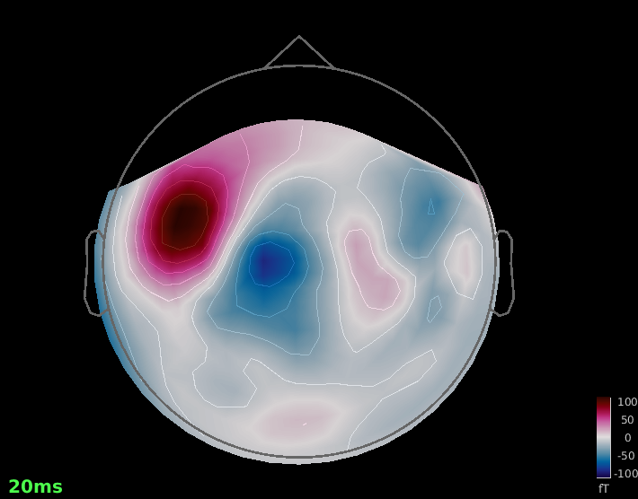
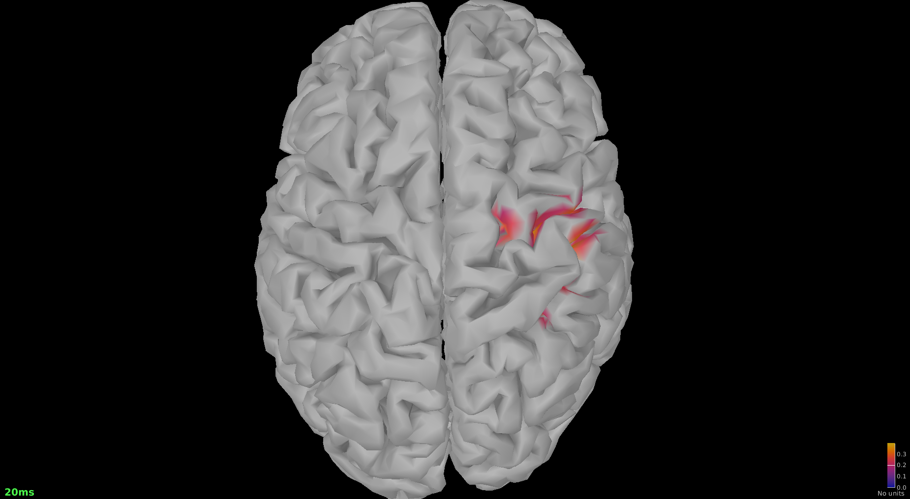
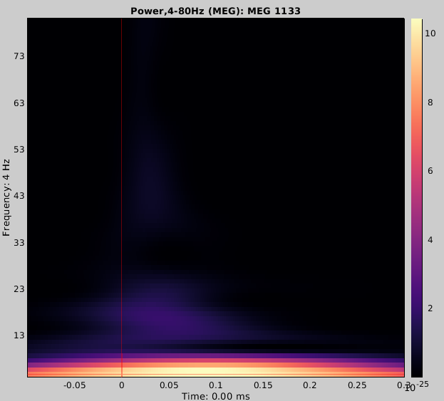

# MEG — ERFs, Sources & Time–Frequency (Brainstorm Median-nerve)

**One-line:** Brainstorm tutorial reproduction: sensor-level ERFs and an early response topography (~20 ms), with dSPM sources and Morlet time–frequency (4–80 Hz).

---

## Overview
This repo reproduces the **Brainstorm “Median-nerve”** tutorial on a compact dataset to demonstrate:
- sensor-level **ERFs**
- **topography at ~20 ms** (early somatosensory response; commonly referred to as N20m)
- **source imaging** with **dSPM** (minimum-norm)
- **time–frequency** with **Morlet wavelets** (4–80 Hz)

## Data & subset
- Dataset: Brainstorm sample dataset **“Median-nerve”** (downloaded from the Brainstorm GUI).
- Subset: **1 subject** (tutorial demo; tiny disk footprint).
- Data policy: **no raw MEG/anatomy is committed**. This repo stores only lightweight outputs (figures/tables) and documentation.

See `DATA_SOURCES.md`.

## Pipeline (high-level)
Brainstorm GUI:
1) Create protocol (default anatomy) → download sample dataset  
2) (Optional) band-pass filter  
3) Import epochs around the stimulation event → compute **average (ERF)**  
4) Head model + **noise covariance** estimated from baseline (**-100 to 0 ms**)  
5) Inverse solution: **Minimum Norm → dSPM** (cortex)  
6) Time–frequency: **Morlet** (4–80 Hz) at a representative sensor  
7) Export figures (PNG) and summary notes

### Key settings reported
- Sources: Minimum Norm (**dSPM**) with noise covariance estimated from baseline (**-100 to 0 ms**).
- Time–frequency: Morlet wavelets (**4–80 Hz**), window **-100 to 300 ms**, shown for a representative sensor (**MEG 1133**) as **raw power** (no baseline normalization available in this export view).

## Results
- **Fig 1:** Sensor-level topography at ~20 ms (early response; N20m).  
  File: `results/figures/fig1.png`
- **Fig 2:** dSPM source map snapshot at ~20 ms.  
  File: `results/figures/fig2_sources_20ms.png`
- **Fig 3:** Morlet time–frequency (4–80 Hz) at sensor **MEG 1133** (-100 to 300 ms).  
  File: `results/figures/fig3_timefrequency_sensor_MEG1133.png` *(raw power; no baseline normalization in this export view)*
- **Mini-report:** `reports/report.md`

## How to reproduce (quick checklist)
1) Brainstorm → `File → New protocol` (use default anatomy)  
2) `Tutorials/Help → Download sample dataset → Median-nerve`  
3) Import epochs (e.g., -100 to 300 ms), compute average  
4) Open topography at ~20 ms → export snapshot as PNG → `results/figures/fig1.png`  
5) Compute sources (head model + noise covariance baseline -100 to 0 ms → dSPM) → export `fig2_sources_20ms.png`  
6) Compute Morlet TF (4–80 Hz) at a representative sensor (e.g., MEG 1133) → export `fig3_timefrequency_sensor_MEG1133.png`  
7) Update `reports/report.md` and commit/publish

## Reproducibility
- Versions: `env/TOOL_VERSIONS.md`
- Limits: single-subject tutorial demo (portfolio entry)

## Cite this work
- Concept DOI: **10.5281/zenodo.17715113**  
- See `CITATION.cff` (GitHub also renders “Cite this repository”)
