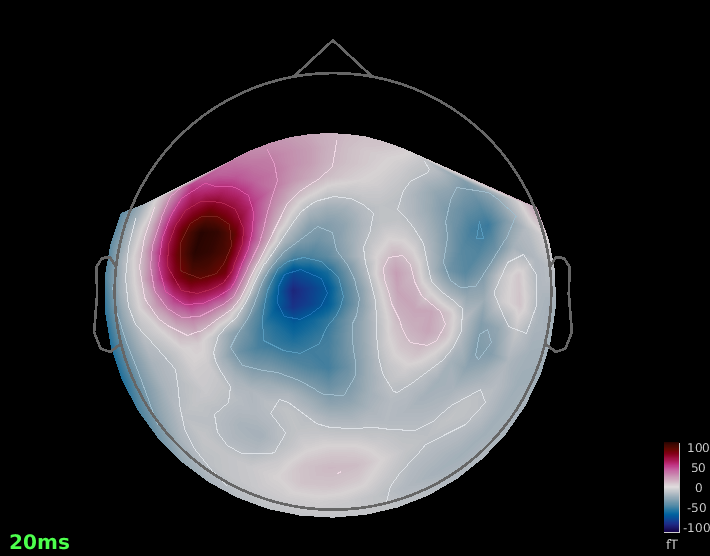
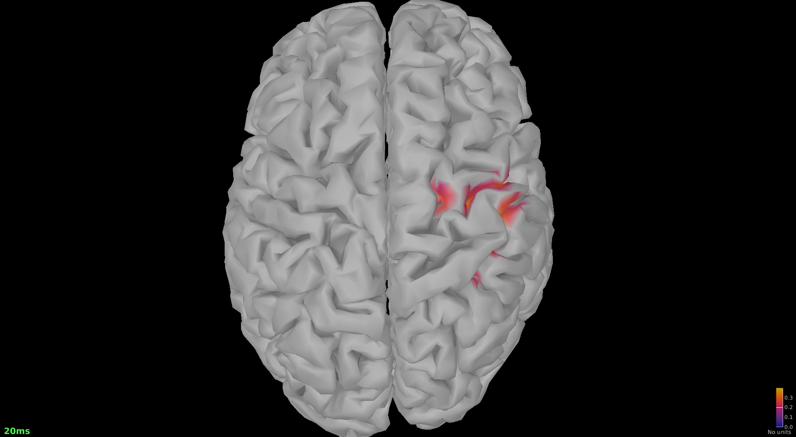
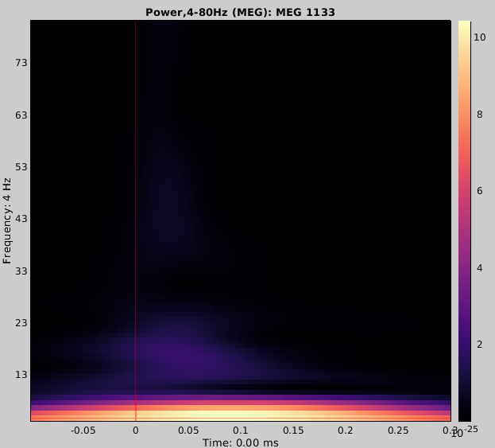

# MEG: ERFs, Sources & Time–Frequency (Brainstorm Median-nerve)

**Goal:** Reproduce a compact Brainstorm median-nerve tutorial workflow and document sensor-level, source-level, and time–frequency results for a single-subject MEG portfolio entry.

---

## Snapshot
- **Dataset:** Brainstorm Median-nerve tutorial dataset
- **Local subset:** 1 subject
- **Condition reported here:** Left median-nerve trials
- **Tools:** MATLAB + Brainstorm
- **Status:** Complete — initial sensor, source, and time–frequency results
- **Last updated:** 2026-07-15

---

## Data
- **Source:** Brainstorm tutorial data
- **What was used:** the tutorial dataset imported into a local Brainstorm protocol
- **Data policy:** raw MEG, anatomy, Brainstorm database files, and large derivatives are not committed

See `../DATA_SOURCES.md` for provenance and data-handling notes.

---

## Pipeline
1. Import the tutorial dataset into Brainstorm
2. Epoch Left median-nerve events from -100 to 300 ms and compute the ERF average
3. Inspect the early sensor-level response around 20 ms
4. Estimate noise covariance from -100 to 0 ms
5. Compute a minimum-norm inverse solution with dSPM
6. Compute Morlet time–frequency power from 4 to 80 Hz at MEG 1133
7. Export lightweight PNG results

---

## Results

### Fig 1 — Sensor-level topography around 20 ms

### Fig 2 — dSPM source reconstruction around 20 ms

### Fig 3 — Morlet time–frequency power at MEG 1133

The time–frequency result covers 4–80 Hz over -100 to 300 ms and is displayed as raw power without baseline normalization in the exported view.

---

## Reproducibility
- Software/environment information: `../env/TOOL_VERSIONS.md`
- Mini-report: `../reports/report.md`
- High-level rerun instructions: `../README.md`
- Limitations: single-subject tutorial dataset; no group-level inference

---

**Author:** Rene Andrade Rey · ORCID: https://orcid.org/0000-0001-5627-579X · Google Scholar: https://scholar.google.es/citations?hl=es&user=Nl3ApFEAAAAJ
